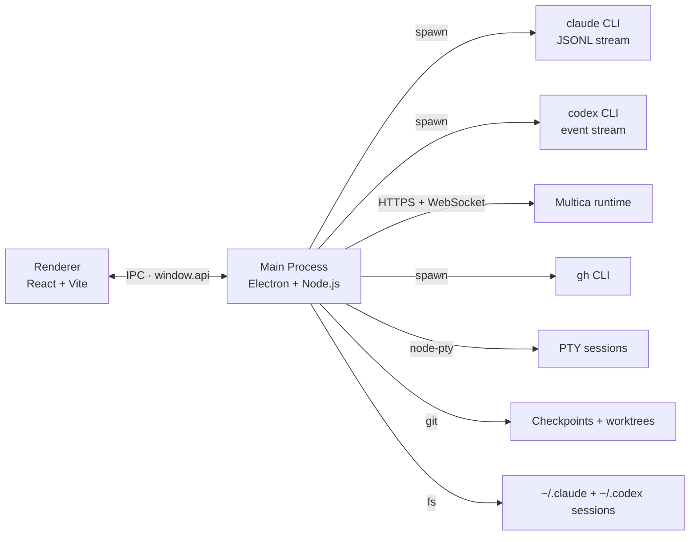

<div align="center">
  

  <h1>RayLine</h1>

  <p><strong>Mission control for parallel coding agents</strong></p>

  <p>A desktop client for Claude Code, Codex, and Multica. Fan out N agents<br/>into N git worktrees with one click, then supervise streaming tool calls,<br/>git-backed checkpoints, and live terminals from a single chat surface.</p>

  <p>
    
    
    
    
    
    
  </p>

  <p>
    <a href="#quick-start">Quick Start</a> ·
    <a href="#highlights">Highlights</a> ·
    <a href="#architecture">Architecture</a> ·
    <a href="docs/architecture.md">Deep Dive</a>
  </p>
</div>

---

## About

RayLine wraps Claude Code, Codex, and connected Multica agents in a native desktop chat, adding the workflow glue a plain terminal session can't give you: persistent conversations, tool-call visibility, image and file attachments, checkpoint-based undo, and an embedded terminal drawer alongside the chat.


## Highlights

| Feature | What it gives you |
|---|---|
| **Dispatch** | Fan out N agents in parallel, each in its own git worktree and branch — from a list of GitHub issues or your own prompts |
| **Streaming chat** | Live tool calls, partial messages, and expandable thinking blocks |
| **Multi-agent** | Switch between Claude, GPT-5.4 Codex, and connected Multica agents per conversation |
| **Checkpoints** | Rewind files to their pre-prompt state using lightweight git snapshots |
| **Terminal drawer** | Persistent PTY sessions (`node-pty` + `xterm.js`) that live alongside the chat |
| **Project Manager** | Built-in GitHub window for issues, PRs, and comments (`gh` CLI under the hood) |
| **Rich rendering** | Markdown, Mermaid diagrams, KaTeX math, syntax highlighting, live HTML blocks |
| **Workspace aware** | Folder picker, branch and worktree selector, per-project session history |
| **Attachments** | Drag-in images and files, plus custom system-prompt context |

## Screenshots

<p align="center">
  
</p>

## Quick Start

You'll need Node.js. The rest depends on which RayLine features you plan to use:

- `claude` on your `PATH` plus an authenticated Claude Code environment for Claude chats and Claude session history
- `codex` on your `PATH` for Codex chats
- `gh` on your `PATH` plus `gh auth login` for the GitHub Project Manager
- a reachable Multica server plus email verification in Settings for Multica chats
- on Windows, Python and the Visual Studio C++ build tools for the `node-pty` rebuild

```bash
npm install
npm run dev:electron
```

That starts the Vite renderer on port `5199` and launches Electron against it.

Claude and Codex are available as soon as their CLIs resolve on your `PATH`. Use **Settings** to connect Multica, and open **GitHub Projects** to finish `gh` authentication if you want the built-in repo/issue/PR tooling.

If Electron or `node-pty` was updated, rebuild the native module first:

```bash
npm run rebuild
```

If you're only working on the main UI, you can skip the rebuild — terminal sessions will stay unavailable until it succeeds.

## Scripts

| Command | Purpose |
|---|---|
| `npm run dev` | Vite renderer only |
| `npm run dev:electron` | Vite + Electron together (default dev flow) |
| `npm run build` | Production renderer bundle |
| `npm run build:electron` | Renderer build plus a packaged desktop app |
| `npm run build:electron:mac` | macOS DMG build |
| `npm run build:electron:win` | Windows NSIS build (skips `npm rebuild`) |
| `npm run lint` | ESLint |
| `npm run preview` | Preview the production renderer |
| `npm run rebuild` | Rebuild `node-pty` for the active Electron version |

## Release Automation

GitHub Actions packages the desktop app for **Windows** and **macOS** only. It runs on:

- manual dispatch via the **Package Desktop App** workflow
- published GitHub releases

Manual runs upload the build output as workflow artifacts. Release runs upload the same files to the GitHub release. Linux packaging is intentionally left out for now because this repo does not have a reliable Linux app validation path yet.

For signed and notarized macOS builds in CI, configure these repository secrets:

- `CSC_LINK`
- `CSC_KEY_PASSWORD`
- `APPLE_SIGNING_IDENTITY` or `CSC_NAME` if the certificate name should be pinned explicitly
- `APPLE_ID`
- `APPLE_APP_SPECIFIC_PASSWORD`
- `APPLE_TEAM_ID`

If the macOS signing secrets are not present, CI falls back to an unsigned DMG so manual packaging still succeeds.

## Architecture



What happens when you hit **Send**:

1. The renderer calls `window.api.agentStart` with the active provider, model, prompt, `cwd`, and attachments.
2. RayLine captures a git checkpoint for the current worktree before the request starts, so later edits can roll files back.
3. The main process routes the request to the Claude CLI, Codex CLI, or Multica bridge.
4. Provider events stream back to the renderer as normalized `agent-stream` IPC events.
5. `useAgent.js` assembles partial deltas into renderable message parts, and session readers can later rehydrate Claude or Codex history from disk.

Full walkthrough lives in [`docs/architecture.md`](docs/architecture.md).

## Project Structure

```text
electron/     Electron main, agent + terminal + checkpoint managers
src/          React application (chat UI, Project Manager)
public/       Static assets and app icons
docs/plans/   Design and implementation notes
build/        Packaging config (entitlements, icons)
scripts/      Dev launchers and shell-facing helpers
```

<details>
<summary><strong>Key files worth opening first</strong></summary>

- `electron/main.cjs` — Electron bootstrap and the IPC surface
- `electron/agent-manager.cjs` — Claude process spawning and stream handling
- `electron/codex-agent-manager.cjs` — Codex CLI spawning and stream handling
- `electron/multica-manager.cjs` — Multica HTTP/WebSocket bridge
- `electron/terminal-manager.cjs` — PTY-backed terminal sessions
- `electron/checkpoint.cjs` — Git-based file checkpoints for edit rewind
- `electron/github-manager.cjs` — `gh` CLI wrapper powering the Project Manager
- `electron/session-reader.cjs` — Claude + Codex session rehydration
- `src/App.jsx` — Top-level chat state and interaction flow
- `src/hooks/useAgent.js` — Streamed message assembly in the renderer
- `src/ProjectManager.jsx` — GitHub Project Manager window

</details>

## Platform Support

RayLine is developed and tested primarily on **macOS**. Windows and Linux builds are **experimental** — they compile and launch, but may have rough edges around native integrations (window chrome, PTY behavior, signing, auto-update). Bug reports from those platforms are welcome.

| Platform | Status | Notes |
|---|---|---|
| macOS | First-class | Signed + notarized DMG; primary development target |
| Windows | Experimental | NSIS installer; `node-pty` needs Python + VS Build Tools. Not all features verified |
| Linux | Experimental | AppImage, `deb`, and `tar.gz` targets. Built but not part of CI validation |

## Contributing & Issues

Bug reports, feature requests, and PRs are welcome at [github.com/EnSue-Laboratories/RAYLINE](https://github.com/EnSue-Laboratories/RAYLINE).
