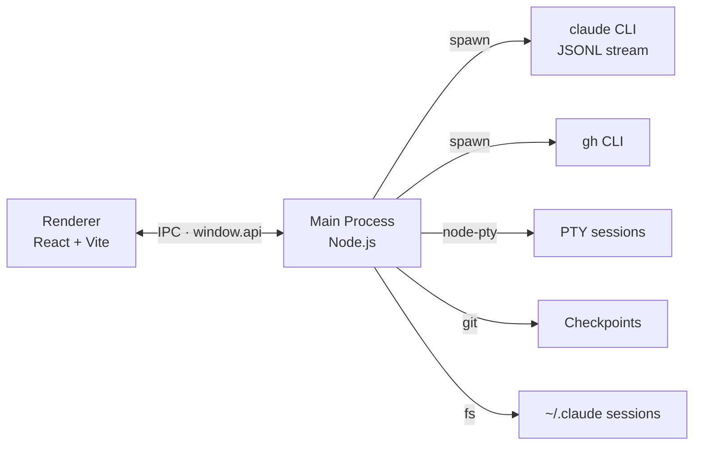

<div align="center">
  

  <h1>RayLine</h1>

  <p><strong>Mission control for parallel coding agents</strong></p>

  <p>A desktop client for Claude Code and GPT-5.4 Codex. Fan out N agents<br/>into N git worktrees with one click, then supervise streaming tool calls,<br/>git-backed checkpoints, and live terminals from a single chat surface.</p>

  <p>
    
    
    
    
    
    
  </p>

  <p>
    <a href="#quick-start">Quick Start</a> ·
    <a href="#highlights">Highlights</a> ·
    <a href="#architecture">Architecture</a> ·
    <a href="ARCH.md">Deep Dive</a>
  </p>
</div>

---

## About

RayLine wraps Claude Code (and GPT-5.4 Codex) in a native desktop chat, adding the workflow glue a plain terminal session can't give you: persistent conversations, tool-call visibility, image and file attachments, checkpoint-based undo, and an embedded terminal drawer alongside the chat.

> This repository is published as `Ensue-Chat`. The packaged app and product name are `RayLine`.

## Highlights

| Feature | What it gives you |
|---|---|
| **Dispatch** | Fan out N agents in parallel, each in its own git worktree and branch — from a list of GitHub issues or your own prompts |
| **Streaming chat** | Live tool calls, partial messages, and expandable thinking blocks |
| **Multi-agent** | Switch between Claude and GPT-5.4 Codex per conversation |
| **Checkpoints** | Rewind files to their pre-prompt state using lightweight git snapshots |
| **Terminal drawer** | Persistent PTY sessions (`node-pty` + `xterm.js`) that live alongside the chat |
| **Project Manager** | Built-in GitHub window for issues, PRs, and comments (`gh` CLI under the hood) |
| **Rich rendering** | Markdown, Mermaid diagrams, KaTeX math, syntax highlighting, live HTML blocks |
| **Workspace aware** | Folder picker, branch and worktree selector, per-project session history |
| **Attachments** | Drag-in images and files, plus custom system-prompt context |

## Screenshots

<p align="center"><em>Screenshots and a short demo GIF are on the way.</em></p>

## Quick Start

You'll need Node.js, the `claude` CLI available on your `PATH`, and an authenticated Claude Code environment. On Windows, the `node-pty` rebuild also needs Python and the Visual Studio C++ build tools.

```bash
npm install
npm run dev:electron
```

That starts the Vite renderer on port `5199` and launches Electron against it.

If Electron or `node-pty` was updated, rebuild the native module first:

```bash
npm run rebuild
```

If you're only working on the main UI, you can skip the rebuild — terminal sessions will stay unavailable until it succeeds.

## Scripts

| Command | Purpose |
|---|---|
| `npm run dev` | Vite renderer only |
| `npm run dev:electron` | Vite + Electron together (default dev flow) |
| `npm run build` | Production renderer bundle |
| `npm run build:electron` | Renderer build plus a packaged desktop app |
| `npm run build:electron:win` | Windows NSIS build (skips `npm rebuild`) |
| `npm run lint` | ESLint |
| `npm run preview` | Preview the production renderer |
| `npm run rebuild` | Rebuild `node-pty` for the active Electron version |

## Architecture



What happens when you hit **Send**:

1. The renderer calls `window.api.agentStart` with the prompt and attachments.
2. The main process spawns `claude --print --output-format=stream-json --include-partial-messages …`.
3. JSONL events stream back to the renderer as `agent-stream` IPC events.
4. `useAgent.js` assembles partial deltas into renderable message parts.
5. A git checkpoint is captured per message so later edits can roll files back.

Full walkthrough lives in [`ARCH.md`](ARCH.md).

## Project Structure

```text
electron/     Electron main, agent + terminal + checkpoint managers
src/          React application (chat UI, Project Manager)
public/       Static assets and app icons
docs/plans/   Design and implementation notes
build/        Packaging config (entitlements, icons)
scripts/      Dev launchers and shell-facing helpers
```

<details>
<summary><strong>Key files worth opening first</strong></summary>

- `electron/main.cjs` — Electron bootstrap and the IPC surface
- `electron/agent-manager.cjs` — Claude process spawning and stream handling
- `electron/codex-agent-manager.cjs` — GPT-5.4 Codex via the OpenAI API
- `electron/terminal-manager.cjs` — PTY-backed terminal sessions
- `electron/checkpoint.cjs` — Git-based file checkpoints for edit rewind
- `electron/github-manager.cjs` — `gh` CLI wrapper powering the Project Manager
- `src/App.jsx` — Top-level chat state and interaction flow
- `src/hooks/useAgent.js` — Streamed message assembly in the renderer
- `src/ProjectManager.jsx` — GitHub Project Manager window

</details>

## Platform Support

| Platform | Status | Notes |
|---|---|---|
| macOS | First-class | Signed + notarized DMG |
| Windows | Supported | NSIS installer; `node-pty` needs Python + VS Build Tools |
| Linux | Supported | AppImage, `deb`, and `tar.gz` targets |

## Notes

- External links are opened in the system browser from the Electron shell.
- App state persists to the Electron user-data directory as `rayline-state.json`.

## Contributing & Issues

Bug reports, feature requests, and PRs are welcome at [github.com/EnSue-Laboratories/RAYLINE](https://github.com/EnSue-Laboratories/RAYLINE).
