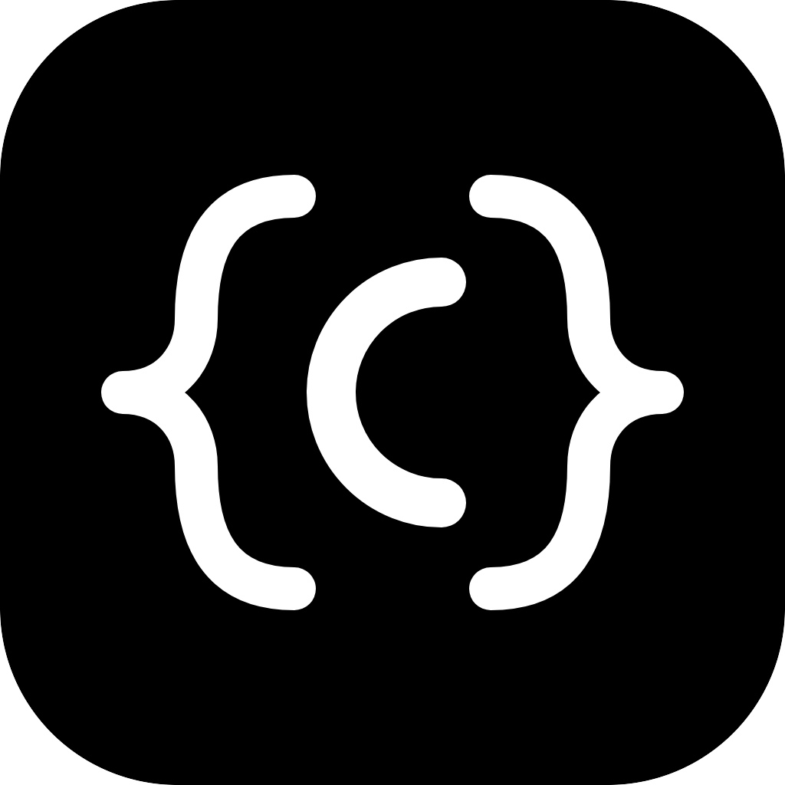
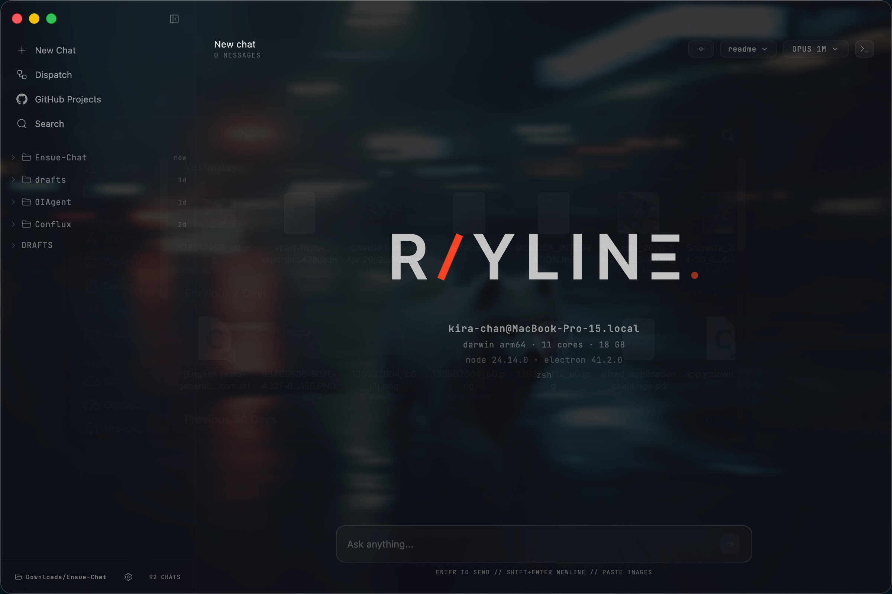
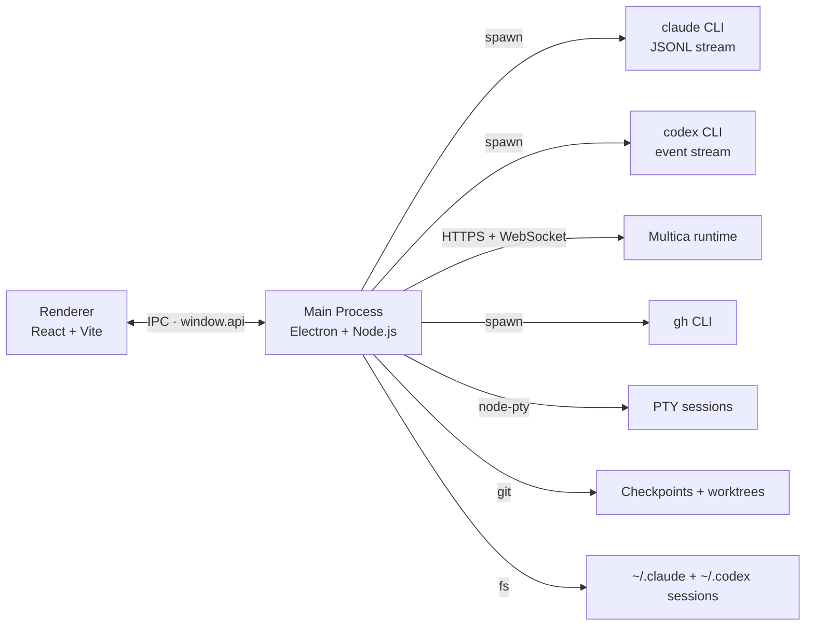

<div align="center">
  

  <h1>RayLine</h1>

  <p><strong>Mission control for parallel coding agents</strong></p>

  <p>A desktop client for Claude Code, Codex, and Multica. Fan out N agents<br/>into N git worktrees with one click, then supervise streaming tool calls,<br/>git-backed checkpoints, and live terminals from a single chat surface.</p>

  <p>
    
    
    
    
    
    
  </p>

  <p>
    <a href="#quick-start">Quick Start</a> ·
    <a href="#highlights">Highlights</a> ·
    <a href="#architecture">Architecture</a> ·
    <a href="docs/architecture.md">Deep Dive</a>
  </p>
</div>

---

## About

RayLine supports Claude Code, Codex, and connected Multica agents in a native desktop chat, adding the workflow glue a plain terminal session can't give you.


## Highlights

| Feature | What it gives you |
|---|---|
| **Dispatch** | Fan out N agents in parallel, each in its own git worktree and branch — from a list of GitHub issues or your own prompts |
| **Streaming chat** | Live tool calls, partial messages, and expandable thinking blocks |
| **Multi-agent** | Switch between Claude, GPT-5.4 Codex, and connected Multica agents per conversation |
| **Checkpoints** | Rewind files to their pre-prompt state using lightweight git snapshots |
| **Terminal drawer** | Persistent PTY sessions (`node-pty` + `xterm.js`) that live alongside the chat |
| **Project Manager** | Built-in GitHub window for issues, PRs, and comments (`gh` CLI under the hood) |
| **Rich rendering** | Markdown, Mermaid diagrams, KaTeX math, syntax highlighting, live HTML blocks |
| **Workspace aware** | Folder picker, branch and worktree selector, per-project session history |
| **Attachments** | Drag-in images and files, plus custom system-prompt context |

## Screenshots

<p align="center">
  
</p>

## Quick Start

You'll need Node.js. The rest depends on which RayLine features you plan to use:

- `claude` on your `PATH` plus an authenticated Claude Code environment for Claude chats and Claude session history
- `codex` on your `PATH` for Codex chats
- `gh` on your `PATH` plus `gh auth login` for the GitHub Project Manager
- a reachable Multica server plus email verification in Settings for Multica chats
- on Windows, Python and the Visual Studio C++ build tools for the `node-pty` rebuild

```bash
npm install
npm run dev:electron
```

That starts the Vite renderer on port `5199` and launches Electron against it.

Verbose debug logging is quiet by default. To enable it while capturing a dev log:

```bash
RAYLINE_VERBOSE_LOGS=1 VITE_RAYLINE_VERBOSE_LOGS=1 npm run dev:electron 2>&1 | tee dev1.log
```

Claude and Codex are available as soon as their CLIs resolve on your `PATH`. Use **Settings** to connect Multica, and open **GitHub Projects** to finish `gh` authentication if you want the built-in repo/issue/PR tooling.

If Electron or `node-pty` was updated, rebuild the native module first:

```bash
npm run rebuild
```

If you're only working on the main UI, you can skip the rebuild — terminal sessions will stay unavailable until it succeeds.

## Architecture



## Project Structure

```text
electron/     Electron main, agent + terminal + checkpoint managers
src/          React application (chat UI, Project Manager)
public/       Static assets and app icons
docs/plans/   Design and implementation notes
build/        Packaging config (entitlements, icons)
scripts/      Dev launchers and shell-facing helpers
```

## Platform Support

RayLine is developed and tested primarily on **macOS**. 
Windows and Linux builds are **experimental**

## Contributing & Issues

Bug reports, feature requests, and PRs are welcome at [github.com/EnSue-Laboratories/RAYLINE](https://github.com/EnSue-Laboratories/RAYLINE).
