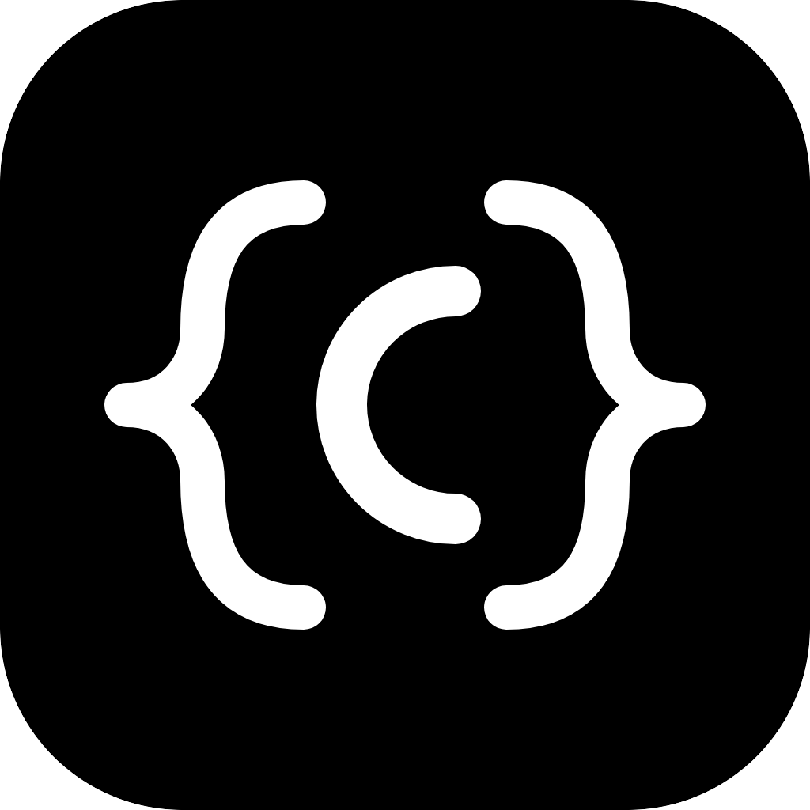
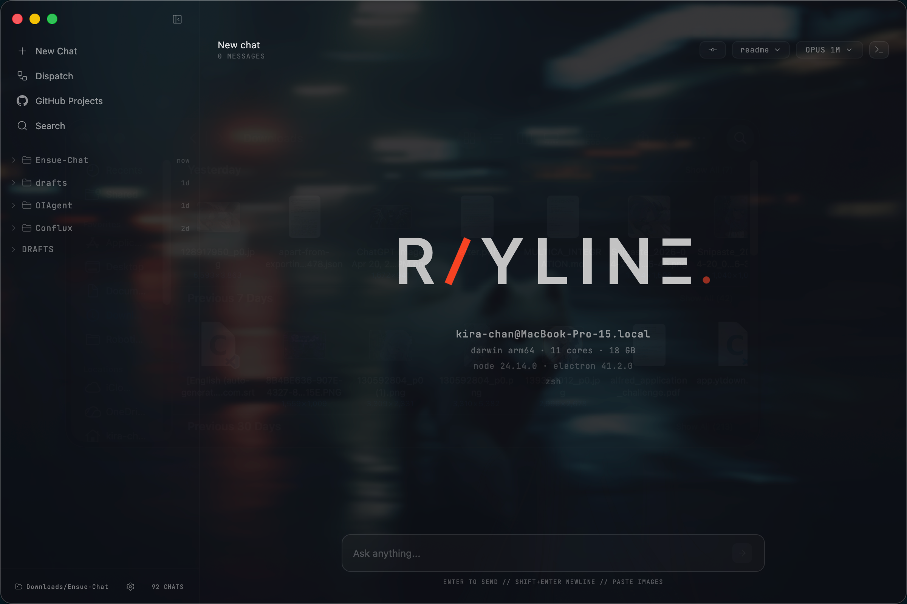
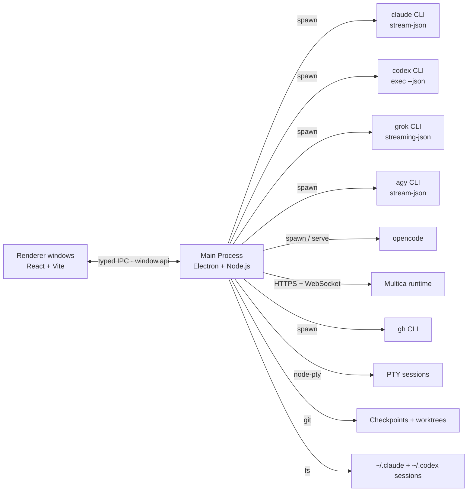

<div align="center">
  

  <h1>RayLine</h1>

  <p><strong>Mission control for parallel coding agents</strong></p>

  <p>A desktop client for Claude Code, Codex, Grok, Antigravity, OpenCode, and Multica. Fan out N agents<br/>into N git worktrees with one click, then supervise streaming tool calls,<br/>git-backed checkpoints, and live terminals from a single chat surface.</p>

  <p>
    
    
    
    
    
    
    
  </p>

  <p>
    <a href="#quick-start">Quick Start</a> ·
    <a href="#highlights">Highlights</a> ·
    <a href="#architecture">Architecture</a> ·
    <a href="docs/architecture.md">Deep Dive</a>
  </p>
</div>

---

## About

RayLine runs Claude Code, Codex, Grok, Antigravity (`agy`), OpenCode, and connected Multica agents in a native desktop chat, adding the workflow glue a plain terminal session can't give you.


## Highlights

| Feature | What it gives you |
|---|---|
| **Dispatch** | Fan out N agents in parallel, each in its own git worktree and branch — from a list of GitHub issues or your own prompts |
| **Streaming chat** | Live tool calls, partial messages, and expandable thinking blocks |
| **Multi-agent** | Switch between Claude, Codex, Grok, Antigravity, OpenCode, and connected Multica agents per conversation |
| **Model picker** | One searchable picker for chats, the new-chat form, and Dispatch, with a separate reasoning-effort selector |
| **Checkpoints** | Rewind files to their pre-prompt state using lightweight git snapshots |
| **Terminal drawer** | Persistent PTY sessions (`node-pty` + `xterm.js`) that live alongside the chat |
| **Project Manager** | Built-in GitHub window for issues, PRs, and comments (`gh` CLI under the hood) |
| **Rich rendering** | Markdown, Mermaid diagrams, KaTeX math, syntax highlighting, live HTML blocks |
| **Workspace aware** | Folder picker, branch and worktree selector, per-project session history |
| **Attachments** | Drag-in images and files, plus custom system-prompt context |

## Screenshots

<p align="center">
  
</p>

## Quick Start

You'll need Node.js 22.18 or newer (the build scripts run TypeScript directly through Node's built-in type stripping) and [pnpm](https://pnpm.io). The pnpm version is pinned in `package.json` (`packageManager`), so any recent pnpm — or `corepack enable` — switches to it automatically. The rest depends on which RayLine features you plan to use:

- `claude` on your `PATH` plus an authenticated Claude Code environment for Claude chats and Claude session history
- `codex` on your `PATH` for Codex chats and Codex session history
- `grok` on your `PATH` (or `GROK_BIN`) plus an authenticated Grok CLI for Grok chats, session resume, and project continuation
- `agy` on your `PATH` (or `AGY_BIN`) plus a signed-in Antigravity CLI for Antigravity chats
- `opencode` on your `PATH` plus a configured provider for OpenCode chats (set up in **Settings**)
- `gh` on your `PATH` plus `gh auth login` for the GitHub Project Manager
- a reachable Multica server plus email verification in Settings for Multica chats
- on Windows, Python and the Visual Studio C++ build tools for the `node-pty` rebuild

```bash
pnpm install
pnpm dev:electron
```

That starts the Vite renderer on port `5199` and launches Electron against it.

Verbose debug logging is quiet by default. To enable it while capturing a dev log:

```bash
RAYLINE_VERBOSE_LOGS=1 VITE_RAYLINE_VERBOSE_LOGS=1 pnpm dev:electron 2>&1 | tee dev1.log
```

Claude, Codex, Grok, and Antigravity are available as soon as their CLIs resolve on your `PATH`. Use **Settings** to connect Multica and configure OpenCode, and open **GitHub Projects** to finish `gh` authentication if you want the built-in repo/issue/PR tooling.

`node-pty` ships N-API prebuilds for macOS and Windows that load in both Node and Electron. On Linux, or if Electron or `node-pty` was updated and terminals stop working, rebuild it for Electron:

```bash
pnpm rebuild:electron
```

If you're only working on the main UI, you can skip the rebuild — terminal sessions will stay unavailable until it succeeds.

## Development

| Command | What it does |
|---|---|
| `pnpm dev:electron` | Vite on `5199` + esbuild watch for the main process + Electron |
| `pnpm typecheck` | `tsc` for the renderer, electron, and node (scripts) projects |
| `pnpm lint` | ESLint with type-aware `typescript-eslint` rules |
| `pnpm test` | Vitest |
| `pnpm build` | Renderer (`dist/`) + main process, preloads, and helpers (`dist-electron/`) |
| `pnpm build:electron` | Build and package for the current platform (`build:electron:mac`, `build:electron:win` for specific targets) |

Dependencies are managed with pnpm (`pnpm-workspace.yaml`):

- `nodeLinker: hoisted` — electron-builder packages a flat `node_modules`.
- `allowBuilds` — dependency install scripts are blocked unless listed (Electron, esbuild, node-pty); `pnpm install` fails on any new, unreviewed build script.
- `minimumReleaseAge: 1440` — versions published in the last 24 hours aren't resolved.

Worktrees can each run `pnpm install`; packages come from pnpm's shared store, so it takes seconds.

Set `RAYLINE_USER_DATA_DIR=<dir>` to run against a separate profile, for example to try a build without touching your real conversations. The codebase is strict TypeScript throughout; see [`docs/refactor/CONVENTIONS.md`](docs/refactor/CONVENTIONS.md) before contributing.

## Models and draft recovery

Open the model picker and start typing a model name, provider, or CLI slug (for example `grok47` or `codex luna`). Arrow keys move through matches, Enter selects, and Escape closes only the picker. The same picker is used in existing chats, the new-chat form, and Dispatch, where tasks can inherit the default model and its reasoning level.

Reasoning effort is chosen next to the model, not baked into the model ID. The effort menu lists the levels the selected model supports and shows the model's default until you pick one; the choice is saved per conversation.

The built-in catalog follows the current Claude Code aliases and Codex model catalog. RayLine also reads model metadata from the installed Codex cache and runs `grok models` and `agy models` to discover what your installed CLIs offer; installed-runtime metadata supplies supported efforts and context sizes. A saved choice that is no longer available stays selected and is labelled instead of being switched silently, and model IDs from older versions keep working. Model availability still depends on the installed CLI and your account.

Unsent text and attachments are kept per conversation. The new-chat form also restores its prompt, model, project, branch/worktree choices, and attachments after navigation or reload, and a rejected send puts the draft back. Project-row **+** and the toolbar's **New chat** open the same form, with the project preselected when applicable.

## Architecture


```mermaid
flowchart LR
  R["Renderer windows<br/>React + Vite"] <-- "typed IPC · window.api" --> M["Main Process<br/>Electron + Node.js"]
  M -- "spawn" --> C["claude CLI<br/>stream-json"]
  M -- "spawn" --> X["codex CLI<br/>exec --json"]
  M -- "spawn" --> GR["grok CLI<br/>streaming-json"]
  M -- "spawn" --> A["agy CLI<br/>stream-json"]
  M -- "spawn / serve" --> O["opencode"]
  M -- "HTTPS + WebSocket" --> U["Multica runtime"]
  M -- "spawn" --> G["gh CLI"]
  M -- "node-pty" --> T["PTY sessions"]
  M -- "git" --> K["Checkpoints + worktrees"]
  M -- "fs" --> S["~/.claude + ~/.codex sessions"]
```

Every IPC channel is declared once in [`shared/ipc/contract.ts`](shared/ipc/contract.ts) and type-checked through the main-process handlers, the preload, and `window.api`. Agent providers stream typed events through an `AgentEventSink`, and the renderer applies them to a copy-on-write store at most once per frame. App state is stored as a small index plus one file per conversation, loaded lazily. Details: [docs/architecture.md](docs/architecture.md). Refactor record: [docs/refactor/SUMMARY.md](docs/refactor/SUMMARY.md).

## Project Structure

```text
shared/       Runtime-agnostic types and pure logic: IPC contract, agent events, model registry, state types
electron/     Main process: bootstrap (main.ts), app/ (windows, lifecycle), ipc/ (typed handlers),
              providers/ (Claude, Codex, OpenCode, Multica, Grok, Antigravity), services/ (state, sessions,
              terminal, git, GitHub), typed preloads
src/          React renderers: chat window (app/, store/, components/), GitHub Projects (pm/), terminal window
public/       Static assets and app icons
docs/         Architecture, refactor notes, design plans, reviews
build/        Packaging config (entitlements, icons)
scripts/      Build and dev scripts (TypeScript on Node) and the terminal CLI helper
```

## Platform Support

RayLine is developed and tested primarily on **macOS**. 
Windows and Linux builds are **experimental**

## Contributing & Issues

Bug reports, feature requests, and PRs are welcome at [github.com/EnSue-Laboratories/RAYLINE](https://github.com/EnSue-Laboratories/RAYLINE).
