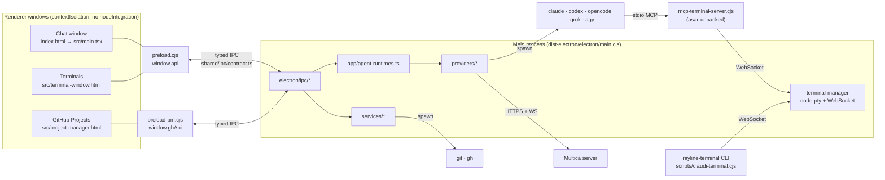
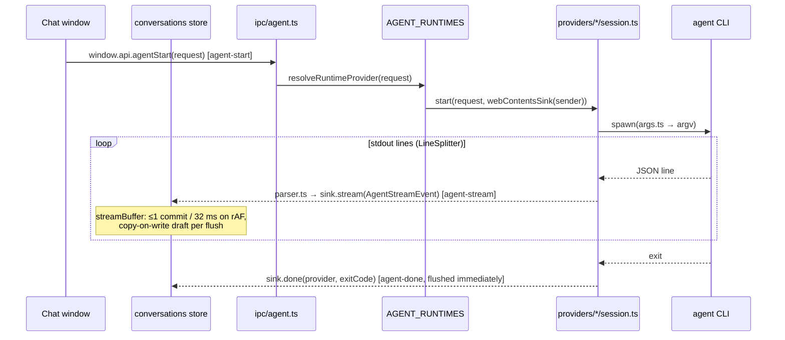

# RayLine Architecture

RayLine is an Electron app written in strict TypeScript. It has three renderer windows (chat, GitHub Projects, Terminals) built with React 19 and Vite. The main process does all privileged work: spawning agent CLIs, PTY sessions, git, `gh`, persistence and network traffic. The two sides talk only through a typed IPC contract in [`shared/`](../shared/README.md).

- How the codebase got here: [`docs/refactor/SUMMARY.md`](refactor/SUMMARY.md)
- Rules for new code: [`docs/refactor/CONVENTIONS.md`](refactor/CONVENTIONS.md)

## Contents

1. [Source layout](#source-layout)
2. [Processes](#processes)
3. [Build pipeline](#build-pipeline)
4. [Typed IPC](#typed-ipc)
5. [Agent providers](#agent-providers)
6. [Model registry](#model-registry)
7. [Persistence (state v2)](#persistence-state-v2)
8. [Renderer state](#renderer-state)
9. [Rendering performance](#rendering-performance)
10. [Terminal subsystem](#terminal-subsystem)
11. [Session reader](#session-reader)
12. [Other main-process services](#other-main-process-services)
13. [i18n](#i18n)
14. [Testing and CI](#testing-and-ci)

## Source layout

```text
shared/      Runtime-agnostic types and pure functions: IPC contract, chat and agent events,
             model registry, state v2 types. Compiled by both the renderer and electron projects.
electron/    Main process
  main.ts      Bootstrap (~50 lines)
  app/         AppContext, windows, lifecycle, agent runtime table, terminal bridge
  ipc/         One module per domain, all registered through ipc/typed.ts
  providers/   Agent providers: claude, codex, opencode, multica, grok, agy, upstreams, common
  services/    Disk and process work: state store, sessions, terminal, checkpoint, github, git, dispatch planner
  preload.ts, preload-pm.ts, preload/ipc.ts      Typed contextBridge preloads
  *-manager.ts, session-reader.ts, …              Stable public entry points over providers/ and services/
src/         Renderers
  main.tsx, App.tsx                Chat window (App is a 27-line composition root)
  pm-main.tsx, ProjectManager.tsx  GitHub Projects window
  terminal-main.tsx, TerminalWindow.tsx            Standalone terminal window
  app/         Chat-window shell: actions, effects, derived stores, persistence planning, components
  store/       createStore, plus the conversations, appSettings, convoList and persistence stores
  components/  UI. Large components are split into folders (chat/, message/, markdown/, blocks/, …)
  i18n/        Typed dictionaries (en-US, zh-CN)
scripts/     Build and dev scripts (run on Node type stripping) and the rayline-terminal CLI
```

## Processes



| Process | Entry | Notes |
|---|---|---|
| Main | [`electron/main.ts`](../electron/main.ts) | Sets the app name and `RAYLINE_USER_DATA_DIR`. Takes the single-instance lock in packaged builds. Warms the login-shell `PATH` in the background. Then runs `createAppContext()` → `registerIpc()` → `registerAppLifecycle()`. |
| Chat window | [`src/main.tsx`](../src/main.tsx) → [`src/App.tsx`](../src/App.tsx) | Preload [`electron/preload.ts`](../electron/preload.ts) exposes `window.api`. |
| GitHub Projects window | [`src/pm-main.tsx`](../src/pm-main.tsx) | Preload [`electron/preload-pm.ts`](../electron/preload-pm.ts) exposes `window.ghApi`. |
| Terminal window | [`src/terminal-main.tsx`](../src/terminal-main.tsx) | Uses the main preload (`window.api`). |
| MCP terminal server | [`electron/mcp-terminal-server.ts`](../electron/mcp-terminal-server.ts) | Standalone stdio MCP server that agents launch through `mcp-terminal.json`. It must not import Electron. |
| `rayline-terminal` CLI | [`scripts/claudi-terminal.ts`](../scripts/claudi-terminal.ts) | Standalone CLI for the terminal WebSocket, handed to Codex and OpenCode. |

Main-process state lives in one typed [`AppContext`](../electron/app/context.ts), created in `main.ts` and passed explicitly to the window, lifecycle and IPC modules. It holds the env flags, resolved paths, window references, terminal UI state, terminal runtime info and the `StateStore`. There are no module-level globals.

## Build pipeline

| Piece | Tool | Output |
|---|---|---|
| Renderer (3 HTML entries) | Vite 8 / Rolldown ([`vite.config.ts`](../vite.config.ts)) | `dist/` |
| Main, preloads, standalone helpers | esbuild ([`scripts/build-electron.ts`](../scripts/build-electron.ts)) | `dist-electron/`, mirroring the source layout |
| Packaging | electron-builder ([`electron-builder.config.ts`](../electron-builder.config.ts)) | `release/` |

`scripts/build-electron.ts` bundles five targets to CommonJS for Node 22:

- `electron/main.cjs`. Runtime `dependencies` stay external (electron-builder ships them, and `node-pty` is native).
- `electron/preload.cjs` and `electron/preload-pm.cjs`. Everything except `electron` is bundled in, because sandboxed preloads can only `require("electron")`.
- `electron/mcp-terminal-server.cjs` and `scripts/claudi-terminal.cjs`. These are fully self-contained, because an external Node runtime executes them.

The build also copies `electron/vendor/` and `electron/shell-init/` next to the bundle. Anything an external process executes is listed in `asarUnpack` and resolved with `toUnpackedPath()` from [`electron/paths.ts`](../electron/paths.ts): the shells, vendored binaries, the MCP server and `dist-electron/scripts/**`. Packaged builds run the MCP server with the app's own binary and `ELECTRON_RUN_AS_NODE=1`, so no system `node` is required. Dev uses `node`.

Vite builds the `main`, `pm` and `terminal` entries with shared `react-vendor`, `markdown` and `xterm` chunks. Heavy optional libraries (Mermaid, KaTeX, html-to-image, rehype-raw/parse5, Prism grammars) are excluded from those groups and load through `import()` at the point of use.

**`npm run dev:electron`** uses `concurrently` to run three things:

1. `vite --port 5199 --strictPort`
2. `node scripts/build-electron.ts --watch` (esbuild watch, inline sourcemaps)
3. `wait-on` for both, then [`scripts/dev-electron.ts`](../scripts/dev-electron.ts), which launches Electron with `VITE_PORT=5199`. The main window loads `http://localhost:5199`.

TypeScript is checked by three projects ([`tsconfig.renderer.json`](../tsconfig.renderer.json), [`tsconfig.electron.json`](../tsconfig.electron.json), [`tsconfig.node.json`](../tsconfig.node.json)). They share [`tsconfig.base.json`](../tsconfig.base.json): `strict`, `noUncheckedIndexedAccess`, `noUnusedLocals`/`Parameters` and the `@shared/*` path alias. `shared/` is part of both the renderer and electron projects, so it can't use DOM or Node APIs.

## Typed IPC

Every channel is declared once in [`shared/ipc/contract.ts`](../shared/ipc/contract.ts):

| Map | Direction | Renderer side | Main side |
|---|---|---|---|
| `InvokeChannels` | request → response | `ipcRenderer.invoke` | `handle()` |
| `SendChannels` | fire-and-forget | `ipcRenderer.send` | `on()` |
| `SyncChannels` | blocking (`beforeunload` only) | `ipcRenderer.sendSync` | `onSync()` |
| `EventChannels` | main → renderer | `ipcRenderer.on` | `sendTo()` / `sendToWindow()` / `broadcast()` |

`args` are named tuples in the order the preload passes them. `result` is what the handler resolves to. The chain from contract to call site is type-checked at every step:

```text
shared/ipc/contract.ts          channel → { args, result }
        │
        ├─ electron/ipc/<domain>.ts   handle("git-status", (_e, cwd) => …)   ← checked by electron/ipc/typed.ts
        │
        ├─ shared/ipc/renderer-api.ts RaylineApi.getGitStatus: Invoker<"git-status">
        │
        ├─ electron/preload.ts        { getGitStatus: invoker("git-status"), … } satisfies RaylineApi
        │
        └─ src/types/window.d.ts      window.api: RaylineApi   →   await window.api.getGitStatus(cwd)
```

**Adding a channel:**

1. Add it to the right map in `shared/ipc/contract.ts`. Put new payload types in `shared/<domain>/types.ts`.
2. Add the method to `RaylineApi` or `GithubApi` in [`shared/ipc/renderer-api.ts`](../shared/ipc/renderer-api.ts), preferably as `Invoker<"…">`, `Sender<"…">` or `EventSubscriber<"…">`.
3. Expose it in `electron/preload.ts` (or `preload-pm.ts`) with the `invoker` / `sender` / `syncSender` / `subscriber` helpers from [`electron/preload/ipc.ts`](../electron/preload/ipc.ts). The `satisfies` check fails until it matches.
4. Register the handler in the domain module under [`electron/ipc/`](../electron/ipc/) with the helpers from [`electron/ipc/typed.ts`](../electron/ipc/typed.ts). New modules go into [`electron/ipc/index.ts`](../electron/ipc/index.ts).

Renderer arguments are only as trustworthy as the preload, so handlers still guard shapes that matter (`unknown` plus a type guard). For a worked checklist, see [`shared/README.md`](../shared/README.md).

## Agent providers



**The seam.** Providers never see Electron. Each provider's `start*` function takes an [`AgentEventSink`](../electron/agent-sink.ts) (`stream`, `done`, `error`, `permissionRequest`, `permissionCancelled`, `isClosed`) and emits only the typed `AgentStreamEvent` union from [`shared/agent/events.ts`](../shared/agent/events.ts). Main wraps the requesting window with `webContentsSink(event.sender)`. Tests use a fake sink.

`agent-done` always carries `provider` and `exitCode: number | null`:

| Outcome | `exitCode` |
|---|---|
| Normal exit | The process exit code |
| Launch failure | `-1` |
| Cancel | `null` |
| Multica | `0` completed, `1` failed, `null` cancelled |

**Routing.** [`electron/app/agent-runtimes.ts`](../electron/app/agent-runtimes.ts) holds an exhaustive `Record<RuntimeProviderId, AgentRuntime>` (`start`, `editResend`, `cancel`, `cancelAll`). Adding a provider id to [`shared/providers/types.ts`](../shared/providers/types.ts) fails to compile until the provider is wired in. `agent-cancel` and app quit fan out to every runtime.

**Per-provider layout.** Each provider lives under [`electron/providers/<id>/`](../electron/providers/). The legacy `electron/*-manager.ts` files stay as the public entries.

| File | Role |
|---|---|
| `args.ts` | Pure argv and prompt builder, including model and effort resolution through the registry |
| `parser.ts` | Pure stdout or stream parser → `AgentStreamEvent`, with exhaustive switches. Unknown event types are dropped. |
| `session.ts` | Lifecycle: spawn (local or over SSH), stream, cancel, done |

Shared helpers live in `providers/common/`: `LineSplitter` (O(n), UTF-8-safe across chunks), `done`, `images`, `json` guards, `models`, `remote-run`, `runtime-env` and `terminal-bridge-info`. stderr buffers keep at most a 256 KB tail.

| Provider | Transport | Notes |
|---|---|---|
| Claude Code ([`providers/claude`](../electron/providers/claude/)) | `claude --print --input-format=stream-json --output-format=stream-json …` | Tool permissions bridged over the stdin control protocol (`permissions.ts`). `--effort` is sent only when the registry allows it. `rewind.ts` handles file rewinds. `usage/` fetches OAuth usage asynchronously (token memoized, requests de-duplicated). Events the renderer ignores (hooks, `thinking_tokens`, `rate_limit_event`, …) are not forwarded. |
| Codex ([`providers/codex`](../electron/providers/codex/)) | `codex exec --json` | No sandbox by default (`--dangerously-bypass-approvals-and-sandbox`). With `CLAUDI_CODEX_BYPASS_SANDBOX=0` it uses `--sandbox workspace-write -c approval_policy="never" --skip-git-repo-check` (`-c sandbox_mode=…` on resume). Effort is passed as `-c model_reasoning_effort="…"`. MCP config is turned into `-c` overrides (`mcp.ts`). The parser handles the current `thread.*` / `turn.*` / `item.*` schema and the legacy events. |
| OpenCode ([`providers/opencode`](../electron/providers/opencode/)) | `opencode run` JSON, or `opencode serve` + SSE | Temporary config and runtime env; server client and registry. |
| Multica ([`providers/multica`](../electron/providers/multica/)) | HTTPS REST + pooled WebSocket | Pure message routing in `ws-messages.ts`. Start failures are reported on the sink. |
| Grok ([`providers/grok`](../electron/providers/grok/)) | `grok … --output-format streaming-json --always-approve --single <prompt>` | Supports `--resume` / `--fork-session` / `--continue`. Events are normalized to the OpenCode shape and tagged `provider: "grok"`. A structured stream error is not repeated as `agent-error`. |
| Antigravity ([`providers/agy`](../electron/providers/agy/)) | `agy --print … --output-format stream-json` | `--conversation` resume, 45 s startup watchdog, SIGKILL escalation. Rejects fork and image payloads; file attachments are passed as paths. |

Related modules:

- **Provider upstreams:** [`electron/provider-upstreams.ts`](../electron/provider-upstreams.ts) and `providers/upstreams/` point Claude or Codex at a custom base URL. For Codex this goes through a local Responses↔Chat bridge.
- **SSH remote runtime:** [`electron/remote-runtime.ts`](../electron/remote-runtime.ts) and `providers/remote/` run the same CLIs over the user's `ssh …` command.
- **System proxy:** [`providers/runtime-env.ts`](../electron/providers/runtime-env.ts) reads the macOS proxy asynchronously (`scutil`) and applies it only when no proxy env vars are set.

## Model registry

The registry lives in [`shared/models/`](../shared/models/) and is shared by main (argv) and renderer (pickers).

- **Static baseline:** [`catalog.ts`](../shared/models/catalog.ts) lists the Claude models (`fable`, `fable-1m`, `opus`, `opus-1m`, `sonnet`, `haiku`) and the Codex models (`gpt-6-astra`, `gpt-6.1-sol`, `gpt-6-sol`, `gpt-6-luna`, `gpt-5.6-sol|terra|luna`, `gpt-5.5`). Grok and AGY have CLI-default entries. Each entry carries context window, `efforts`, `defaultEffort`, lifecycle fields and `minCliVersion`. Sources are in [`docs/refactor/cli-models-research.md`](refactor/cli-models-research.md).
- **Runtime discovery:** the `model-catalog` IPC is served by [`electron/providers/model-catalog.ts`](../electron/providers/model-catalog.ts). It does async I/O only, with timeouts:
  - Codex: reads `$CODEX_HOME/models_cache.json` (default `~/.codex`).
  - Grok: runs `grok models`.
  - AGY: runs `agy models`. Results are cached in `~/.cache/rayline/agy-models.json` for 5 minutes and kept across failed refreshes.

  The combined result is memoized for 60 s. Parsing is pure and lives in [`runtime-catalog.ts`](../shared/models/runtime-catalog.ts) (`parseCodexModelsCache`, `parseGrokModelsOutput`, `parseAgyModelsOutput`). The renderer runs `normalizeRuntimeModelCatalog` → `buildRuntimeModels` → `getAvailableModels(extras)` → `visibleModels`. All pickers share one `useModelCatalog()` store ([`src/components/model-picker/`](../src/components/model-picker/)).
- **Effort is separate from the model id.** A model id identifies a model. Reasoning effort is a per-conversation setting (`conversation.effort`), validated by `resolveEffort()` against `model.efforts`. Grok's project continuation is `conversation.grokContinue`, not an id suffix.
- **Legacy ids.** [`legacy-ids.ts`](../shared/models/legacy-ids.ts) maps every id ever persisted to a current id plus any effort it encoded. That includes `gpt55-high`, `gpt54-med`, `gpt-5.4` and PR #230's `gpt61-sol-high`, `codex-model:<slug>:<effort>`, `grok-47`, `grok-46-continue` and `sonnet-1m`. Loading state calls `normalizeModelSelection()` so the encoded effort and `grokContinue` are kept.
- **Planner capability.** `PLANNER_PROVIDERS` (`claude`, `codex`, `opencode`) and `isPlannerModel()` in [`options.ts`](../shared/models/options.ts) gate the Dispatch planner in both the UI and main.

## Persistence (state v2)

```text
<userData>/state-v2/index.json               settings + conversation metadata (no transcripts)
<userData>/state-v2/conversations/<id>.json  one transcript per conversation (URI-encoded id)
```

**Types:** [`shared/state/types.ts`](../shared/state/types.ts) defines `PersistedAppIndex`, `PersistedConversationFile` and `StateSaveRequest`.

**Main side:** [`electron/services/state-store.ts`](../electron/services/state-store.ts), with `state-store-core`, `state-transform`, `state-disk`, `state-sweep` and `atomic-writer`.

- **Migration:** the first `state:load` with no `index.json` splits the legacy `claudi-state.json` into v2. The legacy file is never modified, so older builds still start.
- **Writes:** async and atomic (temp file + rename), serialized per file, with trailing-write coalescing (the newest data wins, and superseded writes are never stringified). JSON is compact.
- **Close-time saves:** `state:save-sync` bumps a per-file revision. An older in-flight async write re-checks it before renaming, so it can never overwrite the sync data.
- **Tool payload cap:** archived tool `args` / `result` strings longer than `ARCHIVED_TOOL_PAYLOAD_LIMIT` (16 KB) are truncated with a `…[truncated N bytes]` marker.
- **Read-after-write:** `state:load-conversation` sees queued writes that haven't been flushed yet.
- **Legacy channels:** `load-state` / `save-state` / `save-state-sync` still work and are mapped onto v2. The GitHub Projects window gets a settings-only view from memory.

**Renderer side:** [`src/store/persistence.ts`](../src/store/persistence.ts), with save planning in [`src/app/persist/`](../src/app/persist/).

- The index is sent only when its JSON changed. Transcripts are sent only for conversations whose transcript source changed identity, and deletes for removed ones.
- Saves are debounced 1 s, with a 10 s max-wait. `beforeunload` sends only the pending delta through `state:save-sync`.
- **Lazy transcripts:** a conversation's `archivedMessages` are loaded with `state:load-conversation` when it is opened. Transcripts that were never loaded are never written back.

## Renderer state

[`src/store/createStore.ts`](../src/store/createStore.ts) is a ~zustand-shaped external store on `useSyncExternalStore`. Components call `useStore(store, selector, isEqual?)` and re-render only when their slice changes. Handlers are module-level functions that read `store.getState()`, so their identity never changes.

| Store | Holds |
|---|---|
| [`src/store/conversations.ts`](../src/store/conversations.ts) (+ `store/chat/`) | Live chat state per conversation: messages, stream status, native session ids. Selectors: `useMessageIds`, `useMessage`, `useConversationStatus`, `useStreamingIds`, `useConversation`, and the non-reactive `getConversation`. |
| [`src/store/appSettings.ts`](../src/store/appSettings.ts) | Persisted preferences |
| [`src/store/convoList.ts`](../src/store/convoList.ts) | Conversation rows and the active id |
| [`src/store/persistence.ts`](../src/store/persistence.ts) | v2 save scheduler (see above) |
| [`src/app/stores/`](../src/app/stores/) | UI flags, queue, permissions, runtime availability, models, terminal, transcript load status |
| [`src/app/derived/`](../src/app/derived/) | Sidebar rows, pinned tabs, project-picker values. Computed outside React, and each keeps its identity while its content is unchanged. |

**Streaming path.** [`AgentProvider`](../src/app/components/AgentProvider.tsx) only calls `connectAgentEvents()` ([`store/chat/agentBridge.ts`](../src/store/chat/agentBridge.ts)). Stream events go into a [frame-coalesced buffer](../src/store/chat/streamBuffer.ts): at most one commit every 32 ms on `requestAnimationFrame`, and `agent-done` / `agent-error` flush immediately. Each flush applies the batch to one copy-on-write draft ([`store/chat/draft.ts`](../src/store/chat/draft.ts)). The conversations map, the touched conversation, its messages array, the touched message and the touched part are each copied at most once. Everything else keeps its identity, so memoized message and block components skip it. [`applyStreamEvent.ts`](../src/store/chat/applyStreamEvent.ts) is an exhaustive switch over the shared event union, delegating to per-provider reducers (`claudeEvents`, `codexEvents`/`codexItems`, `openCodeEvents`, `multicaEvents`).

[`App.tsx`](../src/App.tsx) holds no state. `AppShell` composes `SidebarPane`, `ChatPane`, `SettingsPane` and `Overlays`. `ModelsBridge` and `TerminalBridge` isolate polling hooks. A streamed token re-renders only the active transcript row, never App, the sidebar or the composer. Settings is an overlay, and ChatArea stays mounted under it (`inert`), so composer drafts survive. Settings, Dispatch, the Multica setup modal and New Project are `React.lazy` and mounted only while open.

## Rendering performance

| Technique | Where |
|---|---|
| **Windowed transcript:** only the last 40 messages are mounted. An IntersectionObserver sentinel prepends 40 more, and the scroll anchor is kept. | [`components/chat/ChatTranscript.tsx`](../src/components/chat/ChatTranscript.tsx), [`logic.ts`](../src/components/chat/logic.ts) |
| **Tool-call grouping:** runs of three or more tool calls collapse to "N tool calls" and mount their children only when expanded. | [`components/message/ToolCallGroup.tsx`](../src/components/message/ToolCallGroup.tsx) |
| **Incremental markdown:** streaming text is split into top-level blocks (fences and `$$` respected), so only the tail block re-parses. A tail over 8 KB re-parses at most at 10 Hz. There is one stable components map, with `isStreaming` passed through context. | [`components/markdown/`](../src/components/markdown/) (`splitBlocks.ts`, `MarkdownText.tsx`, `useThrottledText.ts`) |
| **Lazy heavy dependencies:** PrismLight with 24 grammars (the rest load through `import.meta.glob`), KaTeX, rehype-raw/sanitize, Mermaid, html-to-image and xterm all load on first use. Code is highlighted in idle time. | [`markdown/lazyModules.ts`](../src/components/markdown/lazyModules.ts), [`blocks/mermaidRenderer.ts`](../src/components/blocks/mermaidRenderer.ts) |
| **Memoized blocks:** every block is `memo`. Tool blocks compare the fields they render. Mermaid SVGs are LRU-cached by theme, mode and code. | [`components/blocks/`](../src/components/blocks/), [`components/message/`](../src/components/message/) |
| **Quiet idle:** terminal state is pushed, not polled. Git status uses one refcounted poller per cwd. PM lists keep their identity when nothing changed. | [`hooks/useTerminal.ts`](../src/hooks/useTerminal.ts), [`hooks/useGitStatus.ts`](../src/hooks/useGitStatus.ts) |

The original audit is [`docs/refactor/PERF.md`](refactor/PERF.md). The measured results are in [`SUMMARY.md`](refactor/SUMMARY.md#performance-results).

## Terminal subsystem

- [`electron/terminal-manager.ts`](../electron/terminal-manager.ts) is the entry over [`services/terminal/`](../electron/services/terminal/): `PtySessionRegistry` (node-pty), `TerminalWsServer` (a local WebSocket on a random port), scrollback, saved metadata and the shell env with RayLine's `shell-init` (zsh/bash). A non-shell `command` is typed into an interactive default shell, so its arguments work and the session survives the command.
- [`electron/app/terminal-bridge.ts`](../electron/app/terminal-bridge.ts) does the main-process wiring:
  - starts the WebSocket server;
  - writes `<userData>/mcp-terminal.json` for agents;
  - publishes the port and config path through `providers/common/terminal-bridge-info.ts`;
  - forwards PTY output coalesced per session every 16 ms, only to windows that sent `terminal-output-subscribe`.
- Agents reach terminals through the MCP server ([`services/terminal/mcp-server.ts`](../electron/services/terminal/mcp-server.ts) over `ws-client.ts`). Packaged builds launch it with `process.execPath` and `ELECTRON_RUN_AS_NODE=1`. The `rayline-terminal` CLI uses the same WebSocket client.
- In the renderer, [`useTerminal`](../src/hooks/useTerminal.ts) is push-only. [`components/terminal/`](../src/components/terminal/) lazy-loads xterm. Output for hidden or inactive sessions is buffered (capped at 1M chars) and written in one batch when the session is shown.

## Session reader

[`electron/session-reader.ts`](../electron/session-reader.ts) over [`services/sessions/`](../electron/services/sessions/) reads native Claude (`~/.claude/projects`) and Codex (`~/.codex/sessions`) transcripts for history, resume and sidebar search.

- `SessionIndex` maps sessionId → file using async `readdir` only. It is built lazily and also warmed 1.5 s after startup. A miss triggers one shared rescan.
- All reads are async. Titles and cwds read only the head lines they need.
- Search text is cached by path, mtime and size (LRU, about 64 MB). Full parses are capped at 4 concurrent.
- The renderer keeps at most 4 `loadSession` calls in flight at startup (active conversation first).

Grok and AGY sessions are not indexed yet. See the follow-ups in [`SUMMARY.md`](refactor/SUMMARY.md#known-follow-ups).

## Other main-process services

| Area | Module |
|---|---|
| Git checkpoints (pre-prompt snapshot and restore) | [`electron/checkpoint.ts`](../electron/checkpoint.ts) → `services/checkpoint/` |
| Git ops, worktrees, PRs | [`services/git-ops.ts`](../electron/services/git-ops.ts), `git-worktree.ts`, `git-pr.ts`, pure `git-parse.ts` |
| GitHub (`gh` CLI, web auth through a PTY) | [`electron/github-manager.ts`](../electron/github-manager.ts) → `services/github/` |
| Dispatch planner | [`services/dispatch-planner/`](../electron/services/dispatch-planner/) |
| CLI discovery | [`electron/cli-bin-resolver.ts`](../electron/cli-bin-resolver.ts): async lookup with a positive cache, and a login-shell `PATH` captured once in the background. [`services/cli-status.ts`](../electron/services/cli-status.ts) serves `check-cli-installed`, including `--version`. |
| Auto-update | [`electron/auto-updater.ts`](../electron/auto-updater.ts) (electron-updater). Builds record their commit and repository (`get-app-build`). |

IPC handlers and agent launch paths use async fs and child processes (#237, #239). The deliberate synchronous exceptions are the `*-sync` state channels used from `beforeunload` and the terminal metadata save in `before-quit`.

## i18n

- [`src/i18n/locales/en-US.ts`](../src/i18n/locales/en-US.ts) defines the key set (`MessageKey = keyof typeof enUS`). [`zh-CN.ts`](../src/i18n/locales/zh-CN.ts) `satisfies Record<MessageKey, string>`, so a missing or extra key fails to compile.
- `createTranslator(locale)` ([`src/i18n/index.ts`](../src/i18n/index.ts)) is cached per locale and returns a stable function.
- Each window root mounts `<LocaleProvider>` ([`src/contexts/LocaleContext.tsx`](../src/contexts/LocaleContext.tsx)). Components call `useTranslator()`.

## Testing and CI

- **Unit tests:** Vitest (`npm test`). Tests sit next to the code in `__tests__/` folders or as `*.test.ts`. Most target the pure modules the split produced: parsers, reducers, argv builders, registry and legacy ids, save planning, the state store against temp dirs, git parsers, block splitting and windowing math. Some are end-to-end, such as MCP client → server → WebSocket → real PTY.
- **Static checks:** `npm run typecheck` runs all three tsconfig projects. `npm run lint` runs ESLint with `typescript-eslint` type-aware rules: `no-explicit-any` and `no-unsafe-*` are errors, and react-hooks rules apply.
- **CI:** [`.github/workflows/ci.yml`](../.github/workflows/ci.yml) runs the static checks and the build on Node 22 for pull requests and pushes to `main` / `refactor/typescript`. See the workflow for the exact steps. [`.github/workflows/package.yml`](../.github/workflows/package.yml) packages macOS, Windows and Linux on tags and releases.
