# Multica integration — design

**Status**: approved (brainstorm complete, implementation plan to follow)
**Owner**: Kira
**Date**: 2026-04-20

## Goal

Let a RayLine user chat with remote Multica agents the same way they chat with Claude Code or Codex — one tab, one worktree, one transcript — while Multica runtimes push code to a dedicated branch that RayLine surfaces through its existing git UI.

Target scenario: dispatch three Multica agents onto mac / linux / windows runtimes to adapt code for each platform, then pull each branch down locally, test, and optionally hand off to a local driver (Claude / Codex) to finish.

## Non-goals (v1)

- Multica workspace/agent management (create agent, invite members). Stays in Multica's web UI.
- Inbox, issues, autopilots. Chat-sessions only.
- Reconnect backfill. If the WS drops mid-task, user reopens the chat; we refetch via `GET /api/chat/sessions/{sid}/messages`.
- Per-agent-repo filtering. All online Multica agents appear regardless of the current folder's remote. Mismatches surface as Multica-side errors.
- Turn cancellation UI (the REST exists, but we don't surface it until testing shows it's needed).

## User model

- **Multica chat = RayLine tab**, backed by a local worktree on a branch that mirrors the remote.
- **Model selector = driver selector**. Picking a Multica agent at new-chat time binds this tab to that agent. Switching to Claude/Codex mid-conversation is just re-opening the selector — the tab and worktree stay; Multica's task (if running) is cancelled.
- **Git ops use the existing `GitStatusPill`**. Multica pushes → user sees ↑N → user clicks pull. User can commit/push locally too.
- **Three parallel agents** = three chats = three tabs = three branches = three worktrees. No new UI to coordinate them.

## Integration points (codebase-aware)

### Model registry — `src/data/models.js` + `src/components/ModelPicker.jsx`

- Static `MODELS` array stays for Claude + Codex.
- New hook `useMulticaAgents(workspaceId)` fetches `GET /api/agents` (with `X-Workspace-Slug` header) and returns dynamic entries:
  ```js
  { id: `multica:${agent.id}`, provider: "multica", name: agent.name,
    tag: agent.status.toUpperCase(), agentId, workspaceSlug, workspaceId }
  ```
- `ModelPicker.jsx` renders a third group by iterating `["claude", "codex", "multica"]`. When the Multica section is empty because the user hasn't connected yet, show a single `Connect Multica…` row that opens the setup modal.

### New-chat flow — `NewChatCard.jsx` + `App.jsx` around `:2206–2219`

No UI changes to `NewChatCard`. The existing branch picker + `Tree` toggle cover the hybrid "auto-fresh or pick existing branch" case from brainstorming Q2.

In `App.jsx`'s create-chat path, when the selected model's provider is `"multica"`:

1. Existing `gitWorktreeAdd` / `gitCreateBranch` runs unchanged.
2. **New**: `window.api.gitPush(cwd)` publishes the branch to `origin` (required so Multica's runtime can fetch it).
3. `POST /api/chat/sessions` with `{ agent_id, title }` → store `chat_session_id` on the conversation.
4. Dispatch the first message via `POST /api/chat/sessions/{sid}/messages` with the prompt prefixed by a branch directive:
   > *Work on branch `multica/<slug>` — commit and push there. Your changes will be pulled down by the user locally.*
   > *<user's prompt>*
5. The conversation persists `{ provider: "multica", agentId, workspaceId, chatSessionId, branch }` so the WS subscription can re-attach after app restart.

### Agent driver — `src/hooks/useAgent.js`

No formal provider interface exists today; Claude vs Codex is discriminated by event shape. Add a third branch:

- Instead of `window.api.agentStart(...)`, a Multica conversation subscribes to the shared `multicaClient` for `{ workspaceId, chatSessionId }`.
- Events filtered by `chat_session_id`:
  - `chat:message` role=user → echo into transcript
  - `task:message` → map to `parts`:
    - `type: "text"` → `{ type: "text", text: content }`
    - `type: "tool_use"` → `{ type: "tool_use", name: tool, args: input }`
    - `type: "tool_result"` → `{ type: "tool_result", name: tool, result: output }`
    - `type: "error"` → `{ type: "text", text: content }` with an error style
  - `chat:message` role=assistant → final assistant message, same shape as Claude's completion
  - `chat:done` → turn complete
  - `task:failed` / `task:cancelled` → terminal error state

### Git surface — `GitStatusPill.jsx` + `useGitStatus.js`

No changes. These already take `cwd` (the worktree path) and already implement publish / commit / push / pull. The existing ↑/↓ indicators are exactly the signal the user wants.

### Auth + state — new `src/multica/` module

- `auth.js` — `sendCode(server, email)` / `verifyCode(server, email, code)`, stores JWT per server URL.
- `client.js` — thin REST wrapper (adds `Authorization`, `X-Workspace-Slug`) and single-WS-per-workspace subscription manager.
- `store.js` — persists `{ serverUrl, email, jwt, workspaceId, workspaceSlug, agentCache }` to electron-store.
- Setup modal: server URL → email → code → verify. Auto-discover workspaces (`GET /api/workspaces`): 0 → create with default name, 1 → use silently, N → picker.

## Data flow (happy path)

```dot
digraph {
    rankdir=LR;
    user [shape=ellipse]
    user -> "ModelPicker: MULTICA → mac-runtime"
    "ModelPicker: MULTICA → mac-runtime" -> "NewChatCard submit (Tree on)"
    "NewChatCard submit (Tree on)" -> "gitCreateBranch + gitWorktreeAdd"
    "gitCreateBranch + gitWorktreeAdd" -> "gitPush (publish)"
    "gitPush (publish)" -> "POST /api/chat/sessions"
    "POST /api/chat/sessions" -> "POST /api/chat/sessions/{sid}/messages"
    "POST /api/chat/sessions/{sid}/messages" -> "WS task:message …"
    "WS task:message …" -> "Transcript render (existing Message/ToolCallBlock)"
    "WS task:message …" -> "Multica pushes branch"
    "Multica pushes branch" -> "GitStatusPill ↑N"
    "GitStatusPill ↑N" -> user
}
```



## Open items to verify before coding

1. **Actual stream shape end-to-end.** Capture one real task against `srv1309901.tail96f1f.ts.net` and confirm `task:message` seq ordering, `chat:done` presence/timing, and whether a role=assistant `chat:message` also fires at the end (spec suggests yes; needs confirmation).
2. **How Multica knows the repo.** The `TaskDispatchPayload` has no repo field — binding is likely agent-level via runtime. Verify: when a message says "work on branch multica/foo," does the daemon know *which repo* to check that branch out in? If not, we need a repo hint in the prompt prefix or an agent-to-repo config step.
3. **Workspace slug vs id**. Server accepts either via header; confirm which the frontend should default to. (Slug is stable-per-rename-free, id is immutable.)

These are investigations, not design changes — outcomes might add a line to the prompt prefix or change a header choice, nothing structural.

## Risks

- **Multica agent tied to wrong repo** → task fails silently-ish. Mitigation: surface Multica's error messages verbatim in the transcript so user sees what went wrong.
- **Branch naming collisions** across parallel chats → slug from chat title + short random suffix.
- **Daemon offline mid-task** → user sees no progress. `agent:status` updates the model-picker tag (ONLINE/OFFLINE) so user can notice; surface a disconnected banner on the tab.
- **Auth token expiry** (JWT is 30 days) → refresh via re-auth flow; don't silently drop messages.

## Success criteria

- User can: connect to a Multica server with email + code, pick a Multica agent in the model picker, start a new chat, see `task:message` events stream into the familiar transcript, see Multica's pushed commits appear as ↑N in `GitStatusPill`, pull them down, and optionally continue with Claude/Codex on the same tab.
- No regressions to Claude-Code or Codex flows.
- Three parallel Multica chats can run simultaneously without tab-state leaking between them.

## Implementation plan

To be written next via `superpowers:writing-plans` against this design.
